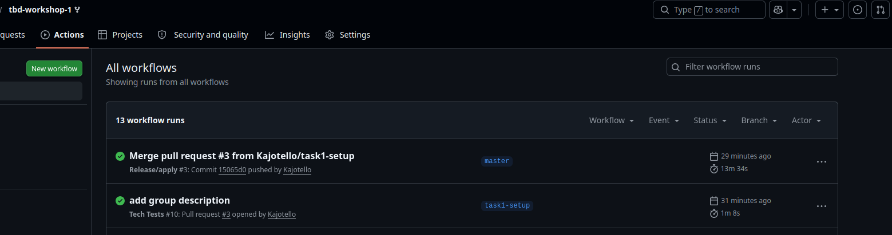
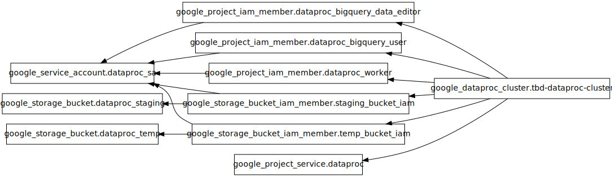
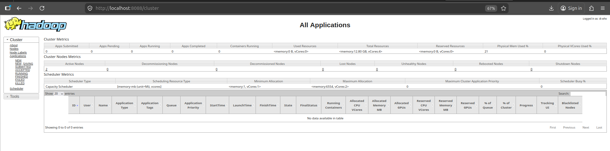
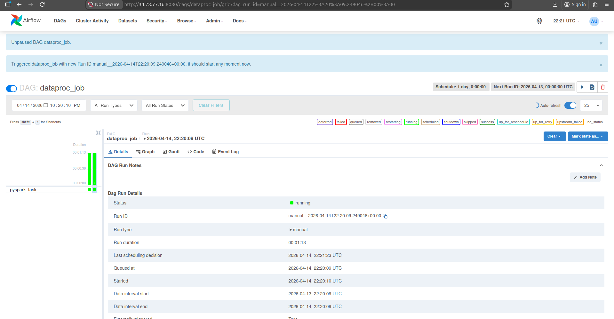
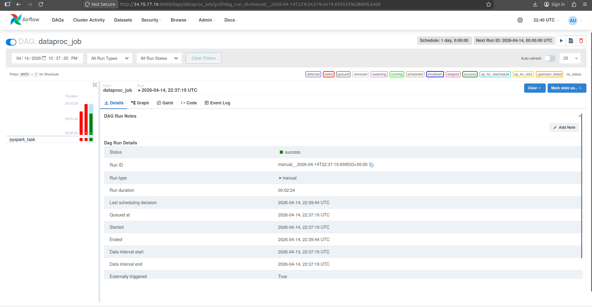

IMPORTANT ❗ ❗ ❗ Please remember to destroy all the resources after each work session. You can recreate infrastructure by creating new PR and merging it to master.


                                                                                                                                                                                                                                                                                                                                                                                  
## Phase 1 Exercise Overview

  ```mermaid
  flowchart TD
      A[🔧 Step 0: Fork repository] --> B[🔧 Step 1: Environment variables\nexport TF_VAR_*]
      B --> C[🔧 Step 2: Bootstrap\nterraform init/apply\n→ GCP project + state bucket]
      C --> D[🔧 Step 3: Quota increase\nCPUS_ALL_REGIONS ≥ 24]
      D --> E[🔧 Step 4: CI/CD Bootstrap\nWorkload Identity Federation\n→ keyless auth GH→GCP]
      E --> F[🔧 Step 5: GitHub Secrets\nGCP_WORKLOAD_IDENTITY_*\nINFRACOST_API_KEY]
      F --> G[🔧 Step 6: pre-commit install]
      G --> H[🔧 Step 7: Push + PR + Merge\n→ release workflow\n→ terraform apply]

      H --> I{Infrastructure\nrunning on GCP}

      I --> J[📋 Task 3: Destroy\nGitHub Actions → workflow_dispatch]
      I --> K[📋 Task 4: New branch\nModify tasks-phase1.md\nPR → merge → new release]
      I --> L[📋 Task 5: Analyze Terraform\nterraform plan/graph\nDescribe selected module]
      I --> M[📋 Task 6: YARN UI\ngcloud compute ssh\nIAP tunnel → port 8088]
      I --> N[📋 Task 7: Architecture diagram\nService accounts + buckets]
      I --> O[📋 Task 8: Infracost\nUsage profiles for\nartifact_registry + storage_bucket]
      I --> P[📋 Task 9: Spark job fix\nAirflow UI → DAG → debug\nFix spark-job.py]
      I --> Q[📋 Task 10: BigQuery\nDataset + external table\non ORC files]
      I --> R[📋 Task 11: Spot instances\npreemptible_worker_config\nin Dataproc module]
      I --> S[📋 Task 12: Auto-destroy\nNew GH Actions workflow\nschedule + cleanup tag]

      style A fill:#4a9eff,color:#fff
      style B fill:#4a9eff,color:#fff
      style C fill:#4a9eff,color:#fff
      style D fill:#ff9f43,color:#fff
      style E fill:#4a9eff,color:#fff
      style F fill:#ff9f43,color:#fff
      style G fill:#4a9eff,color:#fff
      style H fill:#4a9eff,color:#fff
      style I fill:#2ed573,color:#fff
      style J fill:#a55eea,color:#fff
      style K fill:#a55eea,color:#fff
      style L fill:#a55eea,color:#fff
      style M fill:#a55eea,color:#fff
      style N fill:#a55eea,color:#fff
      style O fill:#a55eea,color:#fff
      style P fill:#a55eea,color:#fff
      style Q fill:#a55eea,color:#fff
      style R fill:#a55eea,color:#fff
      style S fill:#a55eea,color:#fff
```

  Legend

  - 🔵 Blue — setup steps (one-time configuration)
  - 🟠 Orange — manual steps (GCP Console / GitHub UI)
  - 🟢 Green — infrastructure ready
  - 🟣 Purple — tasks to complete and document in tasks-phase1.md

1. Authors:

   Group 16
   https://github.com/Kajotello/tbd-workshop-1
   

2. Follow all steps in README.md.

3. From available Github Actions select and run destroy on master branch.

4. Create new git branch and:
    1. Modify tasks-phase1.md file.

    2. Create PR from this branch to **YOUR** master and merge it to make new release.

    ***place the screenshot from GA after successful application of release-DONE***

    


5. Analyze terraform code. Play with terraform plan, terraform graph to investigate different modules.

    ***describe one selected module and put the output of terraform graph for this module here-TODO***

    Dataproc module - module that prepres Google Dataproc environment used to run Spark jobs in the project, it creates the Dataproc cluster itself, dedicated service account, staging and temporary cloud storage buckets and the IAM permissions required      for cluster to work correctly. The graph shows that Dataproc cluster depends on some supporting resources like enabled Dataproc service, Dataproc service account, bucket acess configuration for staging and temp buckets, and IAM roles such as             Dataproc Worker, BigQuery User and BigQuery Data Editor. In this project, this module is used later by Airflow to run the Spark job and save processed results to cloud storage. Module is configured using variables such as projetc and machine             settings, which makes is reusable and easier to manage.

     


6. Reach YARN UI

   ***place the command you used for setting up the tunnel, the port and the screenshot of YARN UI here - DONE***

    ```
    gcloud compute ssh "tbd-cluster-m" \
    --project "tbd-2026l-318716" \
    --zone "europe-west1-b" \
    --tunnel-through-iap \
    -- -L 8088:localhost:8088
    ```
    
    

7. Draw an architecture diagram (e.g. in draw.io) that includes:
    1. Description of the components of service accounts
    2. List of buckets for disposal

    ***place your diagram here - TODO***

    Nie rozumiem co mamy tutaj zrobić na dobrą sprawę

8. Create a new PR and add costs by entering the expected consumption into Infracost
For all the resources of type: `google_artifact_registry_repository`, `google_storage_bucket`
create a sample usage profiles and add it to the Infracost task in CI/CD pipeline. Usage file [example](https://github.com/infracost/infracost/blob/master/infracost-usage-example.yml)

   ***place the expected consumption you entered here - DONE***

   ```yaml
    version: 0.1
        resource_usage:
        google_artifact_registry_repository.my_artifact_registry:
            storage_gb: 500 # Total data stored in the repository in GB
            monthly_egress_data_transfer_gb: # Monthly data delivered from the artifact registry repository in GB. You can specify any number of Google Cloud regions below, replacing - for _ e.g.:
            europe_north1: 400 # GB of data delivered from the artifact registry to europe-north1.
            australia_southeast1: 50 # GB of data delivered from the artifact registry to australia-southeast1.

        google_storage_bucket.my_storage_bucket:
            storage_gb: 200                   # Total size of bucket in GB.
            monthly_class_a_operations: 30000 # Monthly number of class A operations (object adds, bucket/object list).
            monthly_class_b_operations: 20000 # Monthly number of class B operations (object gets, retrieve bucket/object metadata).
            monthly_data_retrieval_gb: 800    # Monthly amount of data retrieved in GB.
            monthly_egress_data_transfer_gb:  # Monthly data transfer from Cloud Storage to the following, in GB:
            same_continent: 1000  # Same continent.
            worldwide: 1875    # Worldwide excluding Asia, Australia.
            asia: 1000           # Asia excluding China, but including Hong Kong.
            china: 0            # China excluding Hong Kong.
            australia: 10       # Australia.
    ```

   ***place the screenshot from infracost output here***

9. Find and correct the error in spark-job.py

    After `terraform apply` completes, connect to the Airflow cluster:
    ```bash
    gcloud container clusters get-credentials airflow-cluster --zone europe-west1-b --project PROJECT_NAME
    ```
    
    Then check the external IP (AIRFLOW_EXTERNAL_IP) of the webserver service:
    kubectl get svc -n airflow airflow-webserver                                                                                                                                                                 
                                              
                                                                                                                                                                                                               
    ▎ Note: If EXTERNAL-IP shows <pending>, wait a moment and retry — LoadBalancer IP allocation may take 1-2 minutes.  

    DAG files are synced automatically from your GitHub repo via git-sync sidecar.
    Airflow variables and the `google_cloud_default` GCP connection are also configured by Terraform.

    a) In the Airflow UI (http://AIRFLOW_EXTERNAL_IP:8080, login: admin/admin), find the `dataproc_job` DAG, unpause it and trigger it manually.

    ***place a screenshot of the DAG in the Airflow UI-DONE***
    

    b) The DAG will fail. Examine the task logs in the Airflow UI to find the root cause.

    ***paste the relevant error message from the Airflow task log - DONE***
    
    ```bash
    status {
        state: ERROR
        details: "Google Cloud Dataproc Agent reports job failure. If logs are available, they can be found at:\nhttps://console.cloud.google.com/dataproc/jobs/ade1ca86-3ed1-4ca6-a23e-b0fba7894b82?project=tbd-2026l-318..."
        state_start_time {
            seconds: 1776205408
            nanos: 882451000
    }
    ```

    ***describe what the error is and how you found it - DONE***

    Logs in airflow contianed only inormation about Google Cloud Dataproc Agent failure. To learn more about root cause of the error we need to check logs in Google Cloud. After visiting link we can easily find information about error in line 42 with details:
    ```json
        {
        "code": 404,
        "errors": [
            {
            "domain": "global",
            "message": "The specified bucket does not exist.",
            "reason": "notFound"
            }
        ],
        "message": "The specified bucket does not exist."
        }
    ```

    c) Fix the error in `modules/data-pipeline/resources/spark-job.py` and re-upload the file to GCS:
    ```bash
    gsutil cp modules/data-pipeline/resources/spark-job.py gs://PROJECT_NAME-code/spark-job.py
    ```
    Then trigger the DAG again from the Airflow UI.

    ***paste the link to the fixed file***

    https://github.com/Kajotello/tbd-workshop-1/blob/master/modules/data-pipeline/resources/spark-job.py

    d) Verify the DAG completes successfully and check that ORC files were written to the data bucket:
    ```bash
    gsutil ls gs://PROJECT_NAME-data/data/shakespeare/
    ```

    ***place a screenshot of the successful DAG run in Airflow UI***
    


11. Create a BigQuery dataset and an external table using SQL

    Using the ORC data produced by the Spark job in task 9, create a BigQuery dataset and an external table.

    Note: the dataset must be created in the same region as the GCS bucket (`europe-west1`), e.g.:
    ```bash
    bq mk --dataset --location=europe-west1 shakespeare
    ```

    ***place the SQL code and query output here***
    
    ```SQL
        CREATE SCHEMA IF NOT EXISTS `tbd-2026l-318716.tbd_dataset`
        OPTIONS (
        location = 'europe-west1'
        );
 

        CREATE EXTERNAL TABLE IF NOT EXISTS `tbd-2026l-318716.tbd_dataset.shakespeare`
        OPTIONS (
        format = 'ORC',
        uris = ['gs://tbd-2026l-318716-data/data/shakespeare/*.orc']
        );
    ```

    ***why does ORC not require a table schema?***

    Because ORC data already contained information about structure as metadata. This metadata could be used during table creation to conclude schema for the table (do uzupełnienia)

12. Add support for preemptible/spot instances in a Dataproc cluster

    ***place the link to the modified file and inserted terraform code***

    ```
    ...
    secondary_worker_config {
      num_instances = 4
      machine_type  = "var.machine_type
      preemptibility = "SPOT" 
    }
    ```

13. Triggered Terraform Destroy on Schedule or After PR Merge. Goal: make sure we never forget to clean up resources and burn money.

Add a new GitHub Actions workflow that:
  1. runs terraform destroy -auto-approve
  2. triggers automatically:

   a) on a fixed schedule (e.g. every day at 20:00 UTC)

   b) when a PR is merged to master containing [CLEANUP] tag in title

Steps:
  1. Create file .github/workflows/auto-destroy.yml
  2. Configure it to authenticate and destroy Terraform resources
  3. Test the trigger (schedule or cleanup-tagged PR)

Hint: use the existing `.github/workflows/destroy.yml` as a starting point.

***paste workflow YAML here***

```yaml
name: Destroy-Auto
on:
  schedule:
      - cron: '0 20 * * *'

  pull_request:
    types: [closed]
    branches:
      - master

permissions: read-all
jobs:
  destroy-release:
    runs-on: ubuntu-latest
  # Add "id-token" with the intended permissions.
    permissions:
      contents: write
      id-token: write
      pull-requests: write
      issues: write

    if: |
      github.event_name == 'schedule' || 
      github.event_name == 'workflow_dispatch' || 
      (github.event.pull_request.merged == true && contains(github.event.pull_request.title, '[CLEANUP]'))
    steps:
    - uses: 'actions/checkout@v3'
    - uses: hashicorp/setup-terraform@v2
      with:
        terraform_version: 1.11.0
    - id: 'auth'
      name: 'Authenticate to Google Cloud'
      uses: 'google-github-actions/auth@v1'
      with:
        token_format: 'access_token'
        workload_identity_provider: ${{ secrets.GCP_WORKLOAD_IDENTITY_PROVIDER_NAME }}
        service_account: ${{ secrets.GCP_WORKLOAD_IDENTITY_SA_EMAIL }}
    - name: Terraform Init
      id: init
      run: terraform init -backend-config=env/backend.tfvars
    - name: Terraform Destroy
      id: destroy
      run: terraform destroy -no-color -var-file env/project.tfvars -auto-approve


```

***paste screenshot/log snippet confirming the auto-destroy ran***

***write one sentence why scheduling cleanup helps in this workshop***
